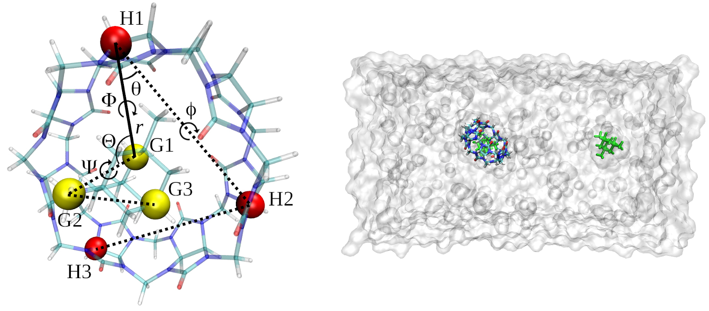

\- - - - - - - - - - - - - - - - - - - - - - - - - - - - - - - - - - - - - - - - - - - - - - - - - - - - - - - - - - - - - - - - - - - - - - - - - - -

*Just released: The new GHOAT.py version including OpenMM, with the follwing new features:*

- Full support for the OpenMM simulation software, including Thermodynamic Integration with Gaussian Quadrature (TI-GQ)

- Automated generation of TI-GQ lambdas and weights

- Inclusion of the orient.tcl plug-in for VMD, without the need to install it.

- New scripts for running the different calculations

- Easy instructions to install all the needed dependencies

- New input files with optimized shorter simulation times

\- - - - - - - - - - - - - - - - - - - - - - - - - - - - - - - - - - - - - - - - - - - - - - - - - - - - - - - - - - - - - - - - - - - - - - - - - - -

# GHOAT.py

The Guest-HOst Affinity Tool (GHOAT.py) is a python tool for fully automated absolute binding free energy calculations applied to guest-host systems. Its workflow encompasses generation of parameters using Antechamber, preparation of the simulation files, and post-processing to retrieve the binding free energy. By using the _pmemd.cuda_ software from AMBER20/22, or OpenMM combined with OpenMM tools, it is able to perform several calculations at at low cost using graphics processing units (GPUs).

GHOAT.py uses the Simultaneous Decoupling and Recoupling (SDR) binding free energy method, which was first introduced by its brother program, the BAT.py software, available at https://github.com/GHeinzelmann/BAT.py [1,2]. The SDR method is suitable for neutral and charged guests, with and without access to the solvent, making GHOAT.py applicable to any guest-host system of choice. Our software also introduces a gold standard for the application/removal of restraints, so the results can be directly applied to guest and host parameter evaluation and optimization.     

# Getting started

To use GHOAT.py, download the files from this repository, which already contain an example for three guest molecules that bind to to the Cucurbit[7]uril host (CB7). In order to perform all the steps from GHOAT.py, the following programs must be installed and in your path:

VMD (Visual Molecular Dynamics) [3] - https://www.ks.uiuc.edu/Development/Download/download.cgi?PackageName=VMD

AmberTools20 or later [4] - http://ambermd.org/AmberTools.php

_pmemd.cuda_ software from AMBER20 [4] - http://ambermd.org/GetAmber.php a

 a Not needed if using OpenMM for the simulations
 
 A quick installation guide for all the dependencies, using the Anaconda package manager, is provided in the Quick-installation-tutorial.pdf file, located inside the ./doc folder. This file also provides a short and command-oriented tutorial for running the GHOAT program with OpenMM/OpenMMtools.

The folder ./GHOAT/structures contains the complex pdb files for the chosen guests, taken directly from the proposed benchmark sets for free energy calculations, available at https://github.com/MobleyLab/benchmarksets [5]. This repository offers input structures and parameters for several guest-host systems, in order to test different binding free energy methods. The coordinate files from [5] are in .rst7 format, and are converted to pdb format using cpptraj from Ambertools. This can be done inside the following folder from the benchmark distribution above:

*benchmarksets-master/input_files/cb7-set1/prmtop-rst7*

, by using the Ambertools cpptraj command (for guest number 1):

cpptraj -p cb7-1.prmtop -y cb7-1.rst7 -x host-cb7-guest-1.pdb > cpptraj.log
 
The resulting pdb file is now placed inside the ./GHOAT/structures folder, named according to the host and guest chosen names as [hostname]-[guestname].pdb. In the present example the pdb complex files are named host-cb7-guest-1.pdb, host-cb7-guest-3.pdb and host-cb7-guest-5.pdb. Other guest-host structures can be downloaded from the benchmark repository in [5], and with the same procedure shown here can be evaluated with GHOAT.py in a fully automated way.

The guest and host partial charges were also taken from the benchmark set (calculated using RESP [6]), and can be found in the ./GHOAT/parameters folder. In order for the program to recognize them, they should be in the form of mol2 files with the same naming as in the structure file, in our case they are the host-cb7.mol2, guest-1.mol2, guest-3.mol2 and guest-5.mol2 files. If charged parameters are not available, GHOAT is able to generate them automatically using the AM1-BCC charge model [7], as explained in the user guide.  

# Running a sample calculation with AMBER

The simulations and analysis from this example will be performed inside the ./GHOAT/ folder. They are divided in equilibration (folder ./equil) and free energy calculation (folder ./fe) steps, the first used to provide an equilibrated structure for the following free energy calculations. The input file with all the needed GHOAT.py parameters is called input-amber.in, with the meaning of each variable explained in more detail in the user guide, located inside the ./doc folder. Briefly, the *host* input parameter gives the name of the host (host-cb7), and the *guest_list* input parameter is a list of guests for which the calculation will be performed ([guest-1,guest-3,guest-5]).  

## Equilibration

The equilibration step starts from the guest-host initial complex structure, gradually releasing restraints applied on the guest relative to the host, and then performing a final simulation with an unrestrained guest. The necessary Lennard-Jones (LJ) and bonded parameters are also generated in this stage, using the General Amber Force Field versions 1 or 2 (GAFF or GAFF2) [8]. To run this step, inside the ./GHOAT/ folder type:

python GHOAT.py -i input-amber.in -s equil

GHOAT.py is compatible with python 3.8 versions. If you have another version, or you find that this command gives an error (such as the absence of the numpy module), you can use the python version included in the Ambertools20/22 distribution:

$AMBERHOME/miniconda/bin/python GHOAT.py -i input-amber.in -s equil

This command will create an ./equil folder, with one folder inside for each of the guests. In order to run the simulations for each guest, you can use the run-local.bash script to run them locally, or use the PBS-run or SLURMM-run scripts provided. Both of these files might have to be adjusted, depending on your computer or server configuration, with their templates inside the ./GHOAT/run\_files foler . The number of simulations and the applied restraints will depend on the *release_eq* array defined in the input file. 

## Free energy calculation 

### Simulations

After the conclusion of the simulations from the equilibrium stage, we can now perform the SDR binding free energy calculations, starting from the final equilibrated state. These simulations will be located inside the ./fe folder. Again in the ./GHOAT/ folder, type:

python GHOAT.py -i input-amber.in -s fe

For each guest, a folder will be created inside ./fe, and inside there will be two folders, ./rest and ./sdr. The ./rest folder contains all the simulations needed for the application/removal of restraints. The ./sdr folder contains the decoupling and recoupling of the guest electrostatic/LJ interactions, in the binding site and in bulk. A script called run-all.bash, inside the ./run_files folder, can be used to run these simulations quickly using the SLURMM scripts located inside each folder.

### Analysis

Once all of the simulations are concluded, it is time to process the output files and obtain the binding free energies. Here a few parameters concerning the analysis can be set in the input file, such as using TI or MBAR [9] for decoupling/recoupling and the number of blocks for block data analysis. Inside the ./GHOAT/ folder type:

python GHOAT.py -i input-amber.in -s analysis

You should see a ./Results directory inside each ./fe/guest folder, with all of the components and the final calculated binding free energy located in the Results.dat file. This folder also contains the results for each of the chosen data blocks, which is useful to check for convergence and fluctuations, and is also used to calculate the uncertainties. This fully automated procedure can be readily applied to any other guest that binds to the CB7 host, and with minimal adjustments it can be extended to any other host.

## Additional hosts

To include a new host system, some additional input data is needed, as explained in the user guide. They include three chosen host anchors for the application of restraints, and possibly a few additional variables and files. These can be found inside the ./host-library folder for all hosts from the proposed benchmarks [5], with new hosts being added and validated with time.    

# More information and GHOAT.py citation

Reference [10] explains the GHOAT calculations and applies it to a few sample systems. Please cite it if using the GHOAT.py software. 

The user guide, inside the ./doc folder, also provides the complete theory behind the calculations, and instructions on how to apply it to any other guest-host system. For more information you can contact the author directly:

Germano Heinzelmann  
Departamento de Física, Universidade Federal de Santa Catarina  
Florianópolis - SC  88040-970 Brasil  
email: germanohei@gmail.com  

# Acknowledgments

Germano Heinzelmann thanks FAPESC and CNPq for the research grants, also Michael Gilson and David Huggins for the support on developing the code.

# References

1. G. Heinzelmann, D. J. Huggins and M. K. Gilson (2024). “BAT2: an Open-Source Tool for Flexible, Automated, and Low Cost Absolute Binding Free Energy Calculations”. Journal of Chemical Theory and Computation, 20, 6518.

2. G. Heinzelmann and M. K. Gilson (2021). “Automation of absolute protein-ligand binding free energy calculations for docking refinement and compound evaluation”. Scientific Reports, 11, 1116.

3. W. Humphrey, A. Dalke and K. Schulten. (1996)  "VMD - Visual Molecular Dynamics", Journal of Molecular Graphics, 14, 33-38.

4. D.A. Case, K. Belfon, I.Y. Ben-Shalom, S.R. Brozell, D.S. Cerutti, T.E. Cheatham, III, V.W.D. Cruzeiro, T.A. Darden, R.E. Duke, G. Giambasu, M.K. Gilson, H. Gohlke, A.W. Goetz, R. Harris, S. Izadi, S.A. Izmailov, K. Kasavajhala, A. Kovalenko, R. Krasny, T. Kurtzman, T.S. Lee, S. LeGrand, P. Li, C. Lin, J. Liu, T. Luchko, R. Luo, V. Man, K.M. Merz, Y. Miao, O. Mikhailovskii, G. Monard, H. Nguyen, A. Onufriev, F.Pan, S. Pantano, R. Qi, D.R. Roe, A. Roitberg, C. Sagui, S. Schott-Verdugo, J. Shen, C. Simmerling, N.R.Skrynnikov, J. Smith, J. Swails, R.C. Walker, J. Wang, L. Wilson, R.M. Wolf, X. Wu, Y. Xiong, Y. Xue, D.M. York and P.A. Kollman (2020), AMBER 2020, University of California, San Francisco.

5. D.L. Mobley, G. Heinzelmann, N.M. Henriksen, and M.K. Gilson. "Predicting binding free energies: Frontiers and benchmarks (a perpetual review)" - https://escholarship.org/uc/item/9p37m6bq.

6. W.D. Cornell, P. Cieplak, C.I. Bayly, and P.A. Kollman. "Application of RESP charges to calculate conformational energies, hydrogen bond energies, and free energies of solvation". Journal of the American Chemical Society, 115, 9620-9631.

7. A. Jakalian, B.L. Bush, D.B. Jack, and C.I. Bayly (2000) "Fast, efficient generation of high‐quality atomic charges. AM1‐BCC model: I. Method". Journal of Computational Chemistry, 21, 132-146.

8. J. Wang, R.M. Wolf, J.W. Caldwell, and P. A. Kollman, D. A. Case (2004) "Development and testing of a general AMBER force field". Journal of Computational Chemistry, 25, 1157-1174.

9. M. R. Shirts and J. Chodera (2008) “Statistically optimal analysis of samples from multiple equilibrium states.” Journal of  Chemical Physics, 129, 129105.

10. F. P. S. Souza, G. Heinzelmann and G. F. Caramori (2023) “Investigating the Solvent Effects on Binding Affinity of PAHs−ExBox4+ Complexes: An Alchemical Approach”. Journal of Physical Chemistry B, 127, 249.

